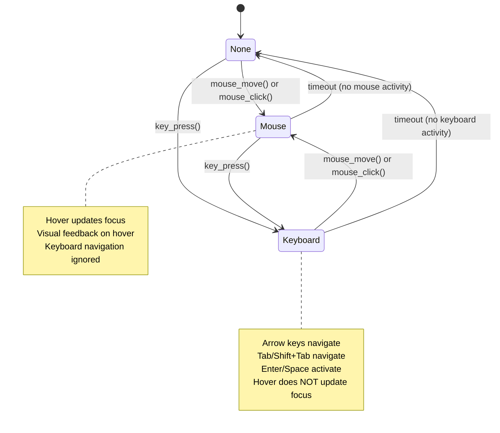

# Input Priority System Design for Neothesia UI Framework

## Executive Summary

This document describes a comprehensive input priority system for the Neothesia UI framework that ensures consistent focus management across all interface components. The system tracks the most recent input method (mouse or keyboard), gives priority to that method, and prevents jitter or conflicts between the two.

## Table of Contents

1. [Problem Statement](#problem-statement)
2. [System Architecture](#system-architecture)
3. [API Design](#api-design)
4. [Implementation Strategy](#implementation-strategy)
5. [Usage Examples](#usage-examples)
6. [Edge Cases](#edge-cases)
7. [Testing Strategy](#testing-strategy)
8. [Migration Guide](#migration-guide)

---

## Problem Statement

### Current Issues

The current PlyUi system has several focus management problems:

1. **Hover Always Overrides Keyboard Focus**: In [`PlyUi::update_widget_state()`](neothesia/src/ply_integration/ui/mod.rs:374-385), hovering over a widget immediately updates both `hovered` and `focused` state, even when keyboard navigation is actively being used.

2. **No Input Priority Tracking**: The system doesn't track which input method was most recently used, leading to conflicts.

3. **Jitter and Conflicts**: When using keyboard navigation, any mouse movement immediately steals focus, creating a poor user experience.

4. **Inconsistent Behavior**: Different widgets may behave differently depending on how they're implemented.

### Requirements

The new system must:

1. Track the most recent input method (mouse or keyboard)
2. Give priority to the most recent input method
3. Prevent jitter or conflicts between input methods
4. Apply consistently across all UI components (main menu, PlySettingsScene, etc.)
5. Maintain backward compatibility where possible
6. Support accessibility features

---

## System Architecture

### Core Concepts

#### Input Priority Modes

```rust
/// Represents which input method currently has priority
#[derive(Debug, Clone, Copy, PartialEq, Eq)]
pub enum InputPriority {
    /// Mouse has priority (most recent mouse interaction)
    Mouse,
    /// Keyboard has priority (most recent keyboard interaction)
    Keyboard,
    /// No priority (initial state, both methods equal)
    None,
}
```

#### Input Priority State

```rust
/// Tracks input priority state
#[derive(Debug, Clone)]
pub struct InputPriorityState {
    /// Current priority mode
    priority: InputPriority,
    
    /// Timestamp of last mouse interaction (for timeout)
    last_mouse_interaction: Option<std::time::Instant>,
    
    /// Timestamp of last keyboard interaction (for timeout)
    last_keyboard_interaction: Option<std::time::Instant>,
    
    /// Whether keyboard is actively being used (keys held)
    keyboard_active: bool,
    
    /// Timeout before priority reverts to None (milliseconds)
    priority_timeout_ms: u64,
}
```

### State Machine



### Integration with PlyUi

The `InputPriorityState` will be added to the `PlyUi` struct:

```rust
pub struct PlyUi {
    // ... existing fields ...
    
    /// Input priority tracking
    input_priority: InputPriorityState,
    
    /// Previous focus before keyboard priority (for restoration)
    focus_before_keyboard: Option<u64>,
}
```

---

## API Design

### New Methods on PlyUi

#### Input Priority Management

```rust
impl PlyUi {
    /// Get current input priority
    pub fn input_priority(&self) -> InputPriority {
        self.input_priority.priority
    }
    
    /// Check if mouse has priority
    pub fn has_mouse_priority(&self) -> bool {
        self.input_priority.priority == InputPriority::Mouse
    }
    
    /// Check if keyboard has priority
    pub fn has_keyboard_priority(&self) -> bool {
        self.input_priority.priority == InputPriority::Keyboard
    }
    
    /// Manually set input priority (for testing or special cases)
    pub fn set_input_priority(&mut self, priority: InputPriority) {
        self.input_priority.priority = priority;
        match priority {
            InputPriority::Mouse => {
                self.input_priority.last_mouse_interaction = Some(std::time::Instant::now());
            }
            InputPriority::Keyboard => {
                self.input_priority.last_keyboard_interaction = Some(std::time::Instant::now());
            }
            InputPriority::None => {
                self.input_priority.last_mouse_interaction = None;
                self.input_priority.last_keyboard_interaction = None;
            }
        }
    }
    
    /// Set priority timeout (how long before priority reverts to None)
    pub fn set_priority_timeout(&mut self, timeout_ms: u64) {
        self.input_priority.priority_timeout_ms = timeout_ms;
    }
}
```

#### Modified Methods

```rust
impl PlyUi {
    /// Handle mouse movement (updated to track priority)
    pub fn mouse_move(&mut self, x: f32, y: f32) {
        self.pointer_pos = (x, y);
        
        // Update input priority
        self.input_priority.priority = InputPriority::Mouse;
        self.input_priority.last_mouse_interaction = Some(std::time::Instant::now());
        
        // If we were in keyboard mode, save the current focus
        if self.input_priority.priority == InputPriority::Keyboard {
            self.focus_before_keyboard = self.focused;
        }
    }
    
    /// Handle mouse button press (updated to track priority)
    pub fn mouse_down(&mut self) {
        self.mouse_pressed = true;
        self.mouse_down = true;
        
        // Update input priority
        self.input_priority.priority = InputPriority::Mouse;
        self.input_priority.last_mouse_interaction = Some(std::time::Instant::now());
    }
    
    /// Handle keyboard event (updated to track priority)
    pub fn handle_key_event(&mut self, key: &WinitKey) -> KeyboardAction {
        use winit::keyboard::NamedKey;
        
        // Update input priority for navigation keys
        let is_navigation_key = matches!(key,
            WinitKey::Named(NamedKey::Tab) |
            WinitKey::Named(NamedKey::ArrowUp) |
            WinitKey::Named(NamedKey::ArrowDown) |
            WinitKey::Named(NamedKey::ArrowLeft) |
            WinitKey::Named(NamedKey::ArrowRight) |
            WinitKey::Named(NamedKey::Enter) |
            WinitKey::Named(NamedKey::Space)
        );
        
        if is_navigation_key {
            self.input_priority.priority = InputPriority::Keyboard;
            self.input_priority.last_keyboard_interaction = Some(std::time::Instant::now());
        }
        
        // ... rest of existing keyboard handling ...
    }
}
```

#### Focus Management Updates

```rust
impl PlyUi {
    /// Update widget state (modified to respect input priority)
    pub fn update_widget_state(&mut self, id: u64, rect: (f32, f32, f32, f32)) -> WidgetState {
        let (x, y, w, h) = rect;
        let (px, py) = self.pointer_pos;
        
        // Check if mouse is over widget
        let mouseover = self.in_scissor_rect(px, py) && px >= x && px <= x + w && py >= y && py <= y + h;
        
        // Update hovered state
        if mouseover {
            self.hovered = Some(id);
        } else if self.hovered == Some(id) {
            self.hovered = None;
        }
        
        // KEY CHANGE: Only update focus on hover if mouse has priority
        if mouseover && self.has_mouse_priority() {
            // Find the widget in the focusable list and update focus
            if let Some(index) = self.focusable_widgets.iter().position(|w| w.id == id) {
                if self.focused != Some(id) {
                    self.focused = Some(id);
                    self.focus_index = index;
                }
            }
        }
        
        // ... rest of existing logic ...
    }
    
    /// Begin frame (updated to handle priority timeout)
    pub fn begin_frame(&mut self, width: f32, height: f32) {
        // ... existing code ...
        
        // Check for priority timeout
        let now = std::time::Instant::now();
        if let Some(last_mouse) = self.input_priority.last_mouse_interaction {
            if now.duration_since(last_mouse).as_millis() as u64 > self.input_priority.priority_timeout_ms {
                // Mouse priority timed out
                if self.input_priority.priority == InputPriority::Mouse {
                    self.input_priority.priority = InputPriority::None;
                }
            }
        }
        
        if let Some(last_keyboard) = self.input_priority.last_keyboard_interaction {
            if now.duration_since(last_keyboard).as_millis() as u64 > self.input_priority.priority_timeout_ms {
                // Keyboard priority timed out
                if self.input_priority.priority == InputPriority::Keyboard {
                    self.input_priority.priority = InputPriority::None;
                }
            }
        }
    }
}
```

### Widget API Changes

Widgets will receive additional context about input priority:

```rust
// In widget build methods, widgets can check priority
impl Button {
    pub fn build(self, ui: &mut PlyUi) -> bool {
        // ... existing code ...
        
        let is_focused = ui.is_focused(widget_id);
        let state = ui.update_widget_state(widget_id, (x, y, self.width, self.height));
        
        // KEY CHANGE: Only show hover effect if mouse has priority
        let should_show_hover = state.hovered && ui.has_mouse_priority();
        
        // Determine background color based on state and priority
        let bg_color = if state.pressed {
            self.pressed_color
        } else if is_focused {
            self.focus_color  // Keyboard focus always shows focus color
        } else if should_show_hover {
            self.hover_color  // Only show hover if mouse has priority
        } else {
            self.color
        };
        
        // ... rest of rendering ...
    }
}
```

---

## Implementation Strategy

### Phase 1: Core Infrastructure (Priority 1)

**Files to Modify:**
- [`neothesia/src/ply_integration/ui/mod.rs`](neothesia/src/ply_integration/ui/mod.rs)

**Tasks:**
1. Add `InputPriority` enum
2. Add `InputPriorityState` struct
3. Add input priority fields to `PlyUi`
4. Implement priority tracking in `mouse_move()`, `mouse_down()`, `handle_key_event()`
5. Implement priority timeout in `begin_frame()`
6. Add public API methods for priority management

**Estimated Complexity:** Medium

### Phase 2: Focus Management Updates (Priority 1)

**Files to Modify:**
- [`neothesia/src/ply_integration/ui/mod.rs`](neothesia/src/ply_integration/ui/mod.rs)

**Tasks:**
1. Modify `update_widget_state()` to respect input priority
2. Update focus management to prevent hover from overriding keyboard focus
3. Add logic to save/restore focus when switching priorities
4. Update `focus_next()` and `focus_previous()` to work with priority

**Estimated Complexity:** Medium

### Phase 3: Widget Updates (Priority 2)

**Files to Modify:**
- [`neothesia/src/ply_integration/ui/widgets.rs`](neothesia/src/ply_integration/ui/widgets.rs)

**Tasks:**
1. Update `Button` widget to respect input priority
2. Update `Slider` widget to respect input priority
3. Update `Dropdown` widget to respect input priority
4. Ensure all widgets show correct visual feedback based on priority

**Estimated Complexity:** Low

### Phase 4: Scene Integration (Priority 2)

**Files to Modify:**
- [`neothesia/src/scene/menu_scene/ply_settings.rs`](neothesia/src/scene/menu_scene/ply_settings.rs)
- [`neothesia/src/scene/ply_scene.rs`](neothesia/src/scene/ply_scene.rs)

**Tasks:**
1. Ensure PlySettingsScene properly initializes input priority
2. Ensure main menu properly initializes input priority
3. Test keyboard navigation in all scenes
4. Test mouse interaction in all scenes

**Estimated Complexity:** Low

### Phase 5: Testing and Validation (Priority 3)

**Tasks:**
1. Write unit tests for input priority state machine
2. Write integration tests for focus management
3. Manual testing with keyboard navigation
4. Manual testing with mouse interaction
5. Test rapid switching between input methods
6. Test accessibility features

**Estimated Complexity:** Medium

---

## Usage Examples

### Example 1: Basic Button with Input Priority

```rust
// In a UI build function
fn build_settings_ui(ui: &mut PlyUi) {
    // Create a button
    let clicked = Button::new()
        .id("save_button")
        .label("Save Settings")
        .pos(100.0, 100.0)
        .size(150.0, 40.0)
        .build(ui);
    
    if clicked {
        // Handle button click
        // This works regardless of input priority
    }
    
    // The button will:
    // - Show hover effect only if mouse has priority
    // - Show focus indicator if keyboard has priority
    // - Accept clicks from mouse
    // - Accept activation from keyboard (Enter/Space)
}
```

### Example 2: Keyboard Navigation

```rust
// User presses Tab
ui.handle_key_event(&Key::Named(NamedKey::Tab));

// System behavior:
// 1. Input priority switches to Keyboard
// 2. Focus moves to next widget
// 3. Hover effects are suppressed
// 4. Focus indicator is shown on newly focused widget

// User moves mouse
ui.mouse_move(250.0, 150.0);

// System behavior:
// 1. Input priority switches to Mouse
// 2. Hovered widget gets focus (if focusable)
// 3. Hover effects are enabled
// 4. Focus indicator follows mouse
```

### Example 3: Slider with Both Input Methods

```rust
fn build_volume_slider(ui: &mut PlyUi, current_volume: f32) -> f32 {
    let (new_volume, is_dragging) = Slider::new("volume")
        .value(current_volume)
        .min(0.0)
        .max(1.0)
        .step(0.01)
        .pos(100.0, 200.0)
        .size(200.0, 30.0)
        .show_value(true)
        .label("Volume")
        .build(ui);
    
    // Slider behavior:
    // - Mouse priority: Drag to adjust, hover shows thumb highlight
    // - Keyboard priority: Arrow keys adjust, focus indicator shown
    // - Both methods show the current value
    
    new_volume
}
```

### Example 4: Dropdown with Keyboard Navigation

```rust
fn build_output_selector(ui: &mut PlyUi, outputs: Vec<String>) -> Option<String> {
    let options: Vec<DropdownOption> = outputs.iter()
        .map(|o| DropdownOption::new(o.clone(), o.clone(), o.clone()))
        .collect();
    
    let (selected_value, changed, should_close) = Dropdown::new("output")
        .options(options)
        .selected_index(0)
        .pos(100.0, 300.0)
        .width(200.0)
        .item_height(35.0)
        .label("Output Device")
        .build(ui);
    
    // Dropdown behavior:
    // - Mouse priority: Click to open, hover to highlight options
    // - Keyboard priority: Enter/Space to open, arrows to navigate
    // - Escape closes dropdown regardless of priority
    
    if should_close {
        // Handle dropdown close
    }
    
    selected_value
}
```

---

## Edge Cases

### 1. Simultaneous Input (Mouse + Keyboard)

**Scenario:** User holds down a key while moving the mouse.

**Solution:**
- Most recent interaction wins
- If key press happened after mouse move, keyboard has priority
- If mouse move happened after key press, mouse has priority
- This is handled naturally by the timestamp tracking

### 2. Rapid Switching Between Input Methods

**Scenario:** User rapidly alternates between mouse and keyboard.

**Solution:**
- Priority switches immediately on each interaction
- No debouncing needed (fast switching is intentional)
- Focus updates smoothly with each switch
- Visual feedback updates immediately

### 3. Hover During Keyboard Navigation

**Scenario:** User is navigating with keyboard when mouse happens to be over a widget.

**Solution:**
- Keyboard priority suppresses hover focus updates
- Widget still shows it's hovered (for visual feedback)
- But focus doesn't change unless user clicks
- This prevents accidental focus changes

### 4. Click During Keyboard Navigation

**Scenario:** User is navigating with keyboard, then clicks a different widget.

**Solution:**
- Mouse click immediately gives mouse priority
- Clicked widget gets focus
- Keyboard navigation state is reset
- This is expected behavior (user explicitly chose mouse)

### 5. Timeout Edge Cases

**Scenario:** Priority timeout expires while user is still interacting.

**Solution:**
- Timeout is generous (default 5 seconds)
- Only expires if no interaction of that type
- Any new interaction of that type resets the timer
- Can be configured per-application if needed

### 6. Accessibility Considerations

**Scenario:** Screen reader user relies entirely on keyboard.

**Solution:**
- Keyboard priority works perfectly with screen readers
- Focus indicators are always visible when keyboard has priority
- No mouse interference
- ARIA attributes can be added for enhanced accessibility

### 7. Gamepad Input

**Scenario:** User is using a gamepad for navigation.

**Solution:**
- Gamepad input can be treated like keyboard input
- Sets keyboard priority
- Gamepad navigation works consistently
- Can be extended in the future if needed

### 8. Touch Input

**Scenario:** User is using a touch screen.

**Solution:**
- Touch input is treated like mouse input
- Sets mouse priority
- Touch and tap work consistently
- Multi-touch gestures can be added later

### 9. Drag and Drop

**Scenario:** User starts dragging with mouse, then uses keyboard.

**Solution:**
- Mouse drag maintains mouse priority
- Keyboard shortcuts during drag can still work
- Drag completion returns to normal priority behavior
- This is a natural extension of the priority system

### 10. Popup and Modal Dialogs

**Scenario:** A popup opens while keyboard has priority.

**Solution:**
- Popup can reset priority to None or set its own priority
- Focus is trapped in the popup (accessibility requirement)
- When popup closes, priority is restored to previous state
- This requires explicit handling in popup code

---

## Testing Strategy

### Unit Tests

```rust
#[cfg(test)]
mod tests {
    use super::*;
    
    #[test]
    fn test_input_priority_initial_state() {
        let ui = PlyUi::new();
        assert_eq!(ui.input_priority(), InputPriority::None);
    }
    
    #[test]
    fn test_mouse_sets_priority() {
        let mut ui = PlyUi::new();
        ui.mouse_move(100.0, 100.0);
        assert_eq!(ui.input_priority(), InputPriority::Mouse);
    }
    
    #[test]
    fn test_keyboard_sets_priority() {
        let mut ui = PlyUi::new();
        ui.handle_key_event(&Key::Named(NamedKey::Tab));
        assert_eq!(ui.input_priority(), InputPriority::Keyboard);
    }
    
    #[test]
    fn test_priority_switching() {
        let mut ui = PlyUi::new();
        
        // Mouse first
        ui.mouse_move(100.0, 100.0);
        assert_eq!(ui.input_priority(), InputPriority::Mouse);
        
        // Then keyboard
        ui.handle_key_event(&Key::Named(NamedKey::Tab));
        assert_eq!(ui.input_priority(), InputPriority::Keyboard);
        
        // Then mouse again
        ui.mouse_move(200.0, 200.0);
        assert_eq!(ui.input_priority(), InputPriority::Mouse);
    }
    
    #[test]
    fn test_hover_respects_priority() {
        let mut ui = PlyUi::new();
        
        // Register some widgets
        ui.register_focusable(1, "Button1".to_string(), WidgetType::Button, (0.0, 0.0, 100.0, 40.0));
        ui.register_focusable(2, "Button2".to_string(), WidgetType::Button, (100.0, 0.0, 100.0, 40.0));
        
        // Set keyboard priority and focus first button
        ui.set_input_priority(InputPriority::Keyboard);
        ui.set_focus(1);
        
        // Hover over second button
        ui.mouse_move(150.0, 20.0);
        ui.update_widget_state(2, (100.0, 0.0, 100.0, 40.0));
        
        // Focus should NOT change (keyboard has priority)
        assert_eq!(ui.focused_widget(), Some(1));
        
        // Now switch to mouse priority
        ui.set_input_priority(InputPriority::Mouse);
        ui.mouse_move(150.0, 20.0);
        ui.update_widget_state(2, (100.0, 0.0, 100.0, 40.0));
        
        // Focus SHOULD change (mouse has priority)
        assert_eq!(ui.focused_widget(), Some(2));
    }
}
```

### Integration Tests

```rust
#[test]
fn test_keyboard_navigation_flow() {
    let mut ui = PlyUi::new();
    
    // Register multiple widgets
    for i in 1..=5 {
        ui.register_focusable(
            i,
            format!("Button{}", i),
            WidgetType::Button,
            ((i - 1) as f32 * 100.0, 0.0, 100.0, 40.0)
        );
    }
    
    // Start with keyboard navigation
    ui.handle_key_event(&Key::Named(NamedKey::Tab));
    assert_eq!(ui.focused_widget(), Some(1));
    
    // Navigate forward
    ui.handle_key_event(&Key::Named(NamedKey::Tab));
    assert_eq!(ui.focused_widget(), Some(2));
    
    // Navigate backward
    ui.handle_key_event(&Key::Named(NamedKey::Tab));
    ui.handle_key_event(&Key::Named(NamedKey::Tab)); // Shift+Tab
    assert_eq!(ui.focused_widget(), Some(1));
    
    // Mouse interaction should change priority
    ui.mouse_move(300.0, 20.0);
    assert_eq!(ui.input_priority(), InputPriority::Mouse);
    assert_eq!(ui.focused_widget(), Some(3)); // Widget under mouse
}
```

### Manual Testing Checklist

- [ ] Tab navigation moves focus through all widgets
- [ ] Shift+Tab navigates backward
- [ ] Arrow keys navigate within sliders
- [ ] Enter/Space activate focused widgets
- [ ] Escape closes popups
- [ ] Mouse hover shows hover effects
- [ ] Mouse click activates widgets
- [ ] Keyboard navigation suppresses hover focus changes
- [ ] Mouse movement during keyboard nav switches priority
- [ ] Rapid switching between mouse and keyboard works smoothly
- [ ] Focus indicators are always visible
- [ ] No jitter or flickering
- [ ] Works in main menu
- [ ] Works in PlySettingsScene
- [ ] Works in all other scenes

---

## Migration Guide

### For Existing Code

Most existing code will continue to work without changes. However, to take full advantage of the new system:

#### 1. Update Widget Building (Optional)

**Before:**
```rust
let clicked = Button::new()
    .label("Click Me")
    .build(ui);
```

**After (No changes required - it just works better):**
```rust
let clicked = Button::new()
    .label("Click Me")
    .build(ui);

// The button now automatically:
// - Respects input priority
// - Shows correct visual feedback
// - Works with both mouse and keyboard
```

#### 2. Custom Widgets (If Applicable)

If you have custom widgets, update them to respect input priority:

**Before:**
```rust
let is_hovered = state.hovered;
let bg_color = if is_hovered { self.hover_color } else { self.color };
```

**After:**
```rust
let should_show_hover = state.hovered && ui.has_mouse_priority();
let bg_color = if is_focused { 
    self.focus_color 
} else if should_show_hover { 
    self.hover_color 
} else { 
    self.color 
};
```

#### 3. Focus Management (Optional)

If you manually manage focus, you can now check priority:

```rust
// Only manually set focus if keyboard has priority
if ui.has_keyboard_priority() {
    ui.set_focus(my_widget_id);
}
```

### Backward Compatibility

The system is designed to be fully backward compatible:

- Existing code continues to work
- Default behavior is improved (no more conflicts)
- No breaking changes to public API
- New methods are additive only

### Configuration

You can configure the priority timeout if needed:

```rust
// Set timeout to 10 seconds instead of default 5
ui.set_priority_timeout(10000);
```

---

## Performance Considerations

### Minimal Overhead

The input priority system adds minimal overhead:

- Timestamp comparisons are very fast
- State tracking is simple enum/struct operations
- No additional allocations
- No complex algorithms

### Memory Impact

Memory impact is negligible:

- One additional enum (InputPriority)
- One additional struct (InputPriorityState)
- A few timestamps (Instant)
- Total: ~50 bytes per PlyUi instance

### CPU Impact

CPU impact is negligible:

- One timestamp check per frame (in begin_frame)
- One priority update per input event
- No loops or iterations
- No expensive operations

---

## Future Enhancements

### Potential Extensions

1. **Gamepad Support**
   - Treat gamepad input like keyboard input
   - Add gamepad-specific navigation patterns

2. **Touch Gesture Support**
   - Recognize swipe gestures
   - Add touch-specific priority modes

3. **Per-Widget Priority**
   - Allow certain widgets to always accept mouse input
   - Allow certain widgets to always accept keyboard input

4. **Priority Hints**
   - Allow widgets to suggest priority based on context
   - Example: sliders suggest mouse priority when dragging

5. **Accessibility Enhancements**
   - Add ARIA attributes for screen readers
   - Add high-contrast mode support
   - Add reduced-motion mode support

6. **Advanced Focus Management**
   - Focus groups (tab cycles within a group)
   - Focus traps (for modals)
   - Focus restoration (return to previous focus after modal closes)

---

## Conclusion

This input priority system provides a robust, consistent solution for focus management across the Neothesia UI framework. It addresses the core issues of hover/keyboard conflicts while maintaining backward compatibility and providing a clear path for future enhancements.

The system is:
- **Simple**: Easy to understand and implement
- **Consistent**: Works the same way across all components
- **Accessible**: Fully supports keyboard navigation
- **Performant**: Minimal overhead
- **Extensible**: Can be enhanced in the future
- **Compatible**: Works with existing code

The phased implementation approach allows for incremental adoption and testing at each stage, ensuring a smooth transition to the new system.
