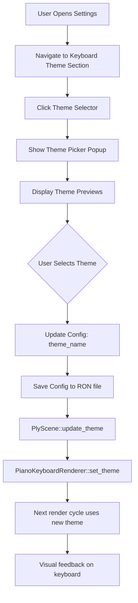

# Piano Keyboard Theme System Design

## Overview

This document outlines the design for a configurable theme system for the piano keyboard in Neothesia. The system allows users to customize the appearance of individual keys with different colors and glow effects, supporting multiple predefined themes and persistent configuration.

## Design Goals

1. **Per-Note Coloring**: Each note within an octave (C, C#, D, D#, E, F, F#, G, G#, A, A#, B) can have different colors
2. **Multiple Themes**: Support multiple predefined themes (Classic, Modern, Rainbow, etc.)
3. **Configurable**: Users can select themes through the settings interface
4. **Persistent**: Theme selection is saved and restored via the existing config system
5. **Visual Effects**: Each note has configurable glow color and intensity

---

## Architecture

### 1. Theme Data Structures

#### 1.1 Note Color Configuration

```rust
/// Color configuration for a single note
#[derive(Clone, Debug, Serialize, Deserialize, PartialEq)]
pub struct NoteColor {
    /// Normal state color (RGB)
    pub normal: (u8, u8, u8),
    /// Pressed state color (RGB)
    pub pressed: (u8, u8, u8),
    /// Glow color (RGB) - optional, defaults to pressed color
    #[serde(default)]
    pub glow: Option<(u8, u8, u8)>,
    /// Glow intensity multiplier (0.0 - 2.0)
    #[serde(default = "default_glow_intensity")]
    pub glow_intensity: f32,
}

fn default_glow_intensity() -> f32 {
    1.0
}

impl NoteColor {
    /// Get the effective glow color (pressed color or custom)
    pub fn glow_color(&self) -> (u8, u8, u8) {
        self.glow.unwrap_or(self.pressed)
    }
}
```

#### 1.2 Per-Octave Theme Definition

```rust
/// Theme colors for all 12 notes in an octave
#[derive(Clone, Debug, Serialize, Deserialize)]
pub struct OctaveTheme {
    /// Colors for each note in the octave (0=C, 1=C#, ..., 11=B)
    #[serde(default)]
    pub notes: [NoteColor; 12],

    /// Global theme settings
    #[serde(default)]
    pub settings: ThemeSettings,
}

impl Default for OctaveTheme {
    fn default() -> Self {
        Self {
            notes: Self::default_notes(),
            settings: ThemeSettings::default(),
        }
    }
}

impl OctaveTheme {
    /// Create default note colors (white/black key pattern)
    fn default_notes() -> [NoteColor; 12] {
        // White keys: C, D, E, F, G, A, B (indices 0, 2, 4, 5, 7, 9, 11)
        // Black keys: C#, D#, F#, G#, A# (indices 1, 3, 6, 8, 10)
        let white = NoteColor {
            normal: (255, 255, 255),
            pressed: (76, 175, 80),
            glow: None,
            glow_intensity: 1.0,
        };
        let black = NoteColor {
            normal: (26, 26, 26),
            pressed: (46, 125, 50),
            glow: None,
            glow_intensity: 1.0,
        };

        let is_sharp = [false, true, false, true, false, false, true, false, true, false, true, false];
        is_sharp.map(|sharp| if sharp { black.clone() } else { white.clone() })
    }

    /// Get color for a specific note (0-11)
    pub fn note_color(&self, note_index: usize) -> &NoteColor {
        &self.notes[note_index % 12]
    }
}
```

#### 1.3 Theme Settings

```rust
/// Global theme settings that apply to all keys
#[derive(Clone, Debug, Serialize, Deserialize)]
pub struct ThemeSettings {
    /// Border color for all keys
    #[serde(default)]
    pub border_color: (u8, u8, u8),

    /// Rounded corner radius
    #[serde(default = "default_corner_radius")]
    pub corner_radius: f32,

    /// 2.5D effect depth (0.0 = flat, higher = more depth)
    #[serde(default = "default_depth_2d5")]
    pub depth_2d5: f32,

    /// Whether to use per-note colors or fall back to simple white/black
    #[serde(default = "default_use_per_note_colors")]
    pub use_per_note_colors: bool,
}

impl Default for ThemeSettings {
    fn default() -> Self {
        Self {
            border_color: (0, 0, 0),
            corner_radius: 4.0,
            depth_2d5: 3.0,
            use_per_note_colors: true,
        }
    }
}

fn default_corner_radius() -> f32 { 4.0 }
fn default_depth_2d5() -> f32 { 3.0 }
fn default_use_per_note_colors() -> bool { true }
```

#### 1.4 Theme Definition

```rust
/// A complete keyboard theme
#[derive(Clone, Debug, Serialize, Deserialize)]
pub struct KeyboardTheme {
    /// Theme name
    pub name: String,

    /// Per-octave color scheme
    pub octave_theme: OctaveTheme,

    /// Theme variant for different styles
    #[serde(default)]
    pub variant: ThemeVariant,
}

/// Theme style variants
#[derive(Clone, Debug, Serialize, Deserialize, PartialEq)]
pub enum ThemeVariant {
    /// Classic piano appearance
    Classic,
    /// Modern with vibrant colors
    Modern,
    /// Flat design without 3D effects
    Flat,
    /// Enhanced 2.5D depth effect
    Depth2D5,
}

impl Default for ThemeVariant {
    fn default() -> Self {
        Self::Modern
    }
}
```

### 2. Predefined Themes

```rust
impl KeyboardTheme {
    /// Classic piano theme (black and white)
    pub fn classic() -> Self {
        Self {
            name: "Classic".to_string(),
            octave_theme: OctaveTheme::default(),
            variant: ThemeVariant::Classic,
        }
    }

    /// Modern theme with green highlights
    pub fn modern() -> Self {
        Self {
            name: "Modern".to_string(),
            octave_theme: OctaveTheme::default(),
            variant: ThemeVariant::Modern,
        }
    }

    /// Rainbow theme - each note has a unique color
    pub fn rainbow() -> Self {
        let notes = [
            // C - Red
            NoteColor { normal: (255, 200, 200), pressed: (255, 50, 50), glow: None, glow_intensity: 1.2 },
            // C# - Red-Orange
            NoteColor { normal: (200, 150, 150), pressed: (255, 100, 0), glow: None, glow_intensity: 1.2 },
            // D - Orange
            NoteColor { normal: (255, 220, 180), pressed: (255, 140, 0), glow: None, glow_intensity: 1.2 },
            // D# - Yellow-Orange
            NoteColor { normal: (200, 160, 130), pressed: (255, 180, 0), glow: None, glow_intensity: 1.2 },
            // E - Yellow
            NoteColor { normal: (255, 255, 200), pressed: (255, 220, 0), glow: None, glow_intensity: 1.2 },
            // F - Yellow-Green
            NoteColor { normal: (220, 255, 200), pressed: (180, 255, 0), glow: None, glow_intensity: 1.2 },
            // F# - Green
            NoteColor { normal: (160, 200, 150), pressed: (0, 200, 0), glow: None, glow_intensity: 1.2 },
            // G - Cyan-Green
            NoteColor { normal: (180, 255, 220), pressed: (0, 255, 128), glow: None, glow_intensity: 1.2 },
            // G# - Cyan
            NoteColor { normal: (150, 200, 200), pressed: (0, 200, 200), glow: None, glow_intensity: 1.2 },
            // A - Blue
            NoteColor { normal: (200, 220, 255), pressed: (50, 100, 255), glow: None, glow_intensity: 1.2 },
            // A# - Blue-Purple
            NoteColor { normal: (180, 160, 200), pressed: (100, 0, 200), glow: None, glow_intensity: 1.2 },
            // B - Purple
            NoteColor { normal: (230, 200, 255), pressed: (180, 0, 255), glow: None, glow_intensity: 1.2 },
        ];

        Self {
            name: "Rainbow".to_string(),
            octave_theme: OctaveTheme {
                notes,
                settings: ThemeSettings {
                    border_color: (50, 50, 50),
                    corner_radius: 6.0,
                    depth_2d5: 4.0,
                    use_per_note_colors: true,
                },
            },
            variant: ThemeVariant::Modern,
        }
    }

    /// Neon theme with bright glowing colors
    pub fn neon() -> Self {
        let notes = [
            NoteColor { normal: (30, 30, 30), pressed: (255, 0, 85), glow: Some((255, 0, 85)), glow_intensity: 1.5 },
            NoteColor { normal: (30, 30, 30), pressed: (0, 255, 255), glow: Some((0, 255, 255)), glow_intensity: 1.5 },
            NoteColor { normal: (30, 30, 30), pressed: (255, 255, 0), glow: Some((255, 255, 0)), glow_intensity: 1.5 },
            NoteColor { normal: (30, 30, 30), pressed: (0, 255, 0), glow: Some((0, 255, 0)), glow_intensity: 1.5 },
            NoteColor { normal: (30, 30, 30), pressed: (255, 0, 255), glow: Some((255, 0, 255)), glow_intensity: 1.5 },
            NoteColor { normal: (30, 30, 30), pressed: (0, 128, 255), glow: Some((0, 128, 255)), glow_intensity: 1.5 },
            NoteColor { normal: (30, 30, 30), pressed: (255, 128, 0), glow: Some((255, 128, 0)), glow_intensity: 1.5 },
            NoteColor { normal: (30, 30, 30), pressed: (128, 0, 255), glow: Some((128, 0, 255)), glow_intensity: 1.5 },
            NoteColor { normal: (30, 30, 30), pressed: (0, 255, 128), glow: Some((0, 255, 128)), glow_intensity: 1.5 },
            NoteColor { normal: (30, 30, 30), pressed: (255, 0, 128), glow: Some((255, 0, 128)), glow_intensity: 1.5 },
            NoteColor { normal: (30, 30, 30), pressed: (128, 255, 0), glow: Some((128, 255, 0)), glow_intensity: 1.5 },
            NoteColor { normal: (30, 30, 30), pressed: (255, 85, 0), glow: Some((255, 85, 0)), glow_intensity: 1.5 },
        ];

        Self {
            name: "Neon".to_string(),
            octave_theme: OctaveTheme {
                notes,
                settings: ThemeSettings {
                    border_color: (20, 20, 20),
                    corner_radius: 8.0,
                    depth_2d5: 2.0,
                    use_per_note_colors: true,
                },
            },
            variant: ThemeVariant::Modern,
        }
    }

    /// Pastel theme with soft colors
    pub fn pastel() -> Self {
        let notes = [
            NoteColor { normal: (255, 240, 245), pressed: (255, 182, 193), glow: None, glow_intensity: 0.8 },
            NoteColor { normal: (240, 248, 255), pressed: (173, 216, 230), glow: None, glow_intensity: 0.8 },
            NoteColor { normal: (255, 250, 240), pressed: (255, 228, 181), glow: None, glow_intensity: 0.8 },
            NoteColor { normal: (245, 255, 250), pressed: (152, 251, 152), glow: None, glow_intensity: 0.8 },
            NoteColor { normal: (255, 240, 245), pressed: (255, 192, 203), glow: None, glow_intensity: 0.8 },
            NoteColor { normal: (240, 255, 240), pressed: (144, 238, 144), glow: None, glow_intensity: 0.8 },
            NoteColor { normal: (230, 230, 250), pressed: (147, 112, 219), glow: None, glow_intensity: 0.8 },
            NoteColor { normal: (255, 245, 238), pressed: (255, 218, 185), glow: None, glow_intensity: 0.8 },
            NoteColor { normal: (240, 255, 255), pressed: (175, 238, 238), glow: None, glow_intensity: 0.8 },
            NoteColor { normal: (255, 250, 250), pressed: (255, 160, 122), glow: None, glow_intensity: 0.8 },
            NoteColor { normal: (245, 255, 245), pressed: (154, 205, 154), glow: None, glow_intensity: 0.8 },
            NoteColor { normal: (250, 240, 230), pressed: (255, 200, 150), glow: None, glow_intensity: 0.8 },
        ];

        Self {
            name: "Pastel".to_string(),
            octave_theme: OctaveTheme {
                notes,
                settings: ThemeSettings {
                    border_color: (200, 200, 200),
                    corner_radius: 5.0,
                    depth_2d5: 2.0,
                    use_per_note_colors: true,
                },
            },
            variant: ThemeVariant::Flat,
        }
    }

    /// Get all available predefined themes
    pub fn predefined_themes() -> Vec<Self> {
        vec![
            Self::classic(),
            Self::modern(),
            Self::rainbow(),
            Self::neon(),
            Self::pastel(),
        ]
    }
}
```

### 3. Config Integration

#### 3.1 Add to Config Model

```rust
// In neothesia-core/src/config/model.rs

#[derive(Serialize, Deserialize, Clone)]
pub struct PianoThemeConfig {
    /// Name of the selected theme
    #[serde(default = "default_piano_theme_name")]
    pub theme_name: String,

    /// Custom theme (if user has modified a theme)
    #[serde(default)]
    pub custom_theme: Option<KeyboardTheme>,
}

fn default_piano_theme_name() -> String {
    "Modern".to_string()
}

#[derive(Serialize, Deserialize, Clone)]
pub enum PianoThemeConfig {
    V1(PianoThemeConfigV1),
}

impl Default for PianoThemeConfig {
    fn default() -> Self {
        Self::V1(PianoThemeConfigV1::default())
    }
}
```

#### 3.2 Add to Main Config

```rust
// In neothesia-core/src/config/model.rs

#[derive(Serialize, Deserialize, Default)]
#[serde(deny_unknown_fields)]
pub struct Model {
    // ... existing fields ...
    #[serde(default)]
    pub piano_theme: PianoThemeConfig,
}
```

#### 3.3 Config Methods

```rust
// In neothesia-core/src/config/mod.rs

impl Config {
    pub fn piano_theme_name(&self) -> &str {
        &self.piano_theme.theme_name
    }

    pub fn set_piano_theme_name(&mut self, name: String) {
        self.piano_theme.theme_name = name;
        self.save();
    }

    pub fn custom_piano_theme(&self) -> Option<&KeyboardTheme> {
        self.piano_theme.custom_theme.as_ref()
    }

    pub fn set_custom_piano_theme(&mut self, theme: Option<KeyboardTheme>) {
        self.piano_theme.custom_theme = theme;
        self.save();
    }
}
```

### 4. Settings UI Integration

#### 4.1 Add Theme Section to Settings

```rust
// In neothesia/src/scene/menu_scene/ply_settings.rs

impl PlySettingsMenu {
    /// Piano Theme settings section
    fn piano_theme_section(
        &mut self,
        ctx: &mut Context,
        ui: &mut PlyUi,
        rows: &dyn Fn(&mut PlyUi, SettingsRow),
        _spacer: &dyn Fn(&mut PlyUi),
        action: &mut SettingsAction,
    ) {
        let themes = KeyboardTheme::predefined_themes();
        let current_theme = ctx.config.piano_theme_name();

        // Theme selector
        SettingsRow::new()
            .title("Keyboard Theme")
            .subtitle(current_theme.to_string())
            .build(ui, |ui, row_w, row_h| {
                let btn_w = 200.0;
                let btn_h = 31.0;

                if Button::new()
                    .pos(row_w - btn_w, center_y(row_h, btn_h))
                    .size(btn_w, btn_h)
                    .label(current_theme)
                    .text_alignment(TextAlignment::Left)
                    .build(ui)
                {
                    *action = SettingsAction::ShowThemePicker;
                }

                // Draw dropdown arrow
                Label::new()
                    .icon("▼".to_string())
                    .pos(row_w - 20.0, center_y(row_h, btn_h))
                    .size(20.0, btn_h)
                    .alignment(TextAlignment::Center)
                    .build(ui);
            })
            .build(ui, rows);
    }

    /// Draw theme selector popup
    fn draw_theme_selector(&mut self, ctx: &mut Context, action: &mut SettingsAction) {
        let win_w = ctx.window_state.logical_size.width;
        let win_h = ctx.window_state.logical_size.height;

        let popup_w = 350.0;
        let popup_h = 400.0;
        let popup_x = center_x(win_w, popup_w);
        let popup_y = center_y(win_h, popup_h);

        // Draw overlay
        Quad::new()
            .pos(0.0, 0.0)
            .size(win_w, win_h)
            .color([0, 0, 0, 180])
            .build(&mut self.ui);

        // Draw popup background
        Quad::new()
            .pos(popup_x, popup_y)
            .size(popup_w, popup_h)
            .color([45, 43, 50])
            .border_radius([10.0; 4])
            .build(&mut self.ui);

        // Draw title
        Label::new()
            .text("Select Keyboard Theme")
            .pos(popup_x + 10.0, popup_y + 10.0)
            .size(popup_w - 20.0, 30.0)
            .font_size(18.0)
            .bold(true)
            .build(&mut self.ui);

        // Draw theme options with preview
        let themes = KeyboardTheme::predefined_themes();
        let mut y = popup_y + 50.0;

        for theme in &themes {
            let is_selected = ctx.config.piano_theme_name() == theme.name;

            // Draw option background
            if is_selected {
                Quad::new()
                    .pos(popup_x + 10.0, y)
                    .size(popup_w - 20.0, 50.0)
                    .color([160, 81, 255])
                    .border_radius([5.0; 4])
                    .build(&mut self.ui);
            }

            // Draw mini keyboard preview
            self.draw_mini_keyboard_preview(
                &mut self.ui,
                popup_x + 20.0,
                y + 5.0,
                150.0,
                40.0,
                theme,
            );

            // Draw theme name
            Label::new()
                .text(&theme.name)
                .pos(popup_x + 180.0, y + 15.0)
                .size(150.0, 20.0)
                .font_size(16.0)
                .color(if is_selected { [255, 255, 255] } else { [200, 200, 200] })
                .build(&mut self.ui);

            // Make clickable
            if Button::new()
                .id(&format!("theme_{}", theme.name))
                .pos(popup_x + 10.0, y)
                .size(popup_w - 20.0, 50.0)
                .color([0, 0, 0, 0])
                .build(&mut self.ui)
            {
                *action = SettingsAction::SelectTheme(theme.name.clone());
            }

            y += 55.0;
        }

        // Close button
        if Button::new()
            .pos(popup_x + popup_w - 40.0, popup_y + 10.0)
            .size(30.0, 30.0)
            .label("✕")
            .build(&mut self.ui)
        {
            *action = SettingsAction::ClosePopup;
        }
    }

    /// Draw mini keyboard preview for theme selection
    fn draw_mini_keyboard_preview(
        &self,
        ui: &mut PlyUi,
        x: f32,
        y: f32,
        width: f32,
        height: f32,
        theme: &KeyboardTheme,
    ) {
        // Draw one octave (7 white keys)
        let white_key_width = width / 7.0;

        // Draw white keys
        for i in 0..7 {
            let note_index = [0, 2, 4, 5, 7, 9, 11][i];
            let note_color = theme.octave_theme.note_color(note_index);
            let color = note_color.normal;

            Quad::new()
                .pos(x + i as f32 * white_key_width, y)
                .size(white_key_width - 1.0, height)
                .color(color)
                .border_radius([2.0; 4])
                .build(ui);
        }

        // Draw black keys
        let black_key_width = white_key_width * 0.6;
        let black_key_height = height * 0.6;
        let black_key_positions = [0, 1, 3, 4, 5]; // C#, D#, F#, G#, A#

        for (i, pos) in black_key_positions.iter().enumerate() {
            let note_index = [1, 3, 6, 8, 10][i];
            let note_color = theme.octave_theme.note_color(note_index);
            let color = note_color.normal;

            Quad::new()
                .pos(x + (*pos as f32 + 0.7) * white_key_width, y)
                .size(black_key_width, black_key_height)
                .color(color)
                .border_radius([2.0; 4])
                .build(ui);
        }
    }
}
```

#### 4.2 Add SettingsAction Variants

```rust
// In neothesia/src/scene/menu_scene/ply_settings.rs

#[derive(Debug, Clone, PartialEq, Eq)]
pub enum SettingsAction {
    // ... existing variants ...
    ShowThemePicker,
    SelectTheme(String),
}
```

### 5. Rendering Pipeline Modifications

#### 5.1 Update PianoKeyboardRenderer

```rust
// In neothesia/src/render/ply/piano_keyboard.rs

pub struct PianoKeyboardRenderer {
    // ... existing fields ...
    theme: KeyboardTheme,
}

impl PianoKeyboardRenderer {
    /// Set the keyboard theme
    pub fn set_theme(&mut self, theme: KeyboardTheme) {
        self.theme = theme;
    }

    /// Get note color for a specific MIDI note
    fn get_note_color(&self, note: u8) -> &NoteColor {
        let note_index = (note % 12) as usize;
        self.theme.octave_theme.note_color(note_index)
    }

    /// Render a single key with theme colors
    fn render_key(&self, key: &VisualKey) {
        let note_color = self.get_note_color(key.note);
        let settings = &self.theme.octave_theme.settings;

        // Use per-note colors if enabled, otherwise fall back to simple white/black
        let (base_rgb, pressed_rgb) = if settings.use_per_note_colors {
            (note_color.normal, note_color.pressed)
        } else {
            // Fallback to simple white/black based on key type
            if key.is_sharp {
                ((26, 26, 26), (46, 125, 50))
            } else {
                ((255, 255, 255), (76, 175, 80))
            }
        };

        let base_color = Color::from_rgba(
            base_rgb.0, base_rgb.1, base_rgb.2, 255
        );
        let pressed_color = Color::from_rgba(
            pressed_rgb.0, pressed_rgb.1, pressed_rgb.2, 255
        );

        let anim = key.animation.value;
        let effective_anim = if anim > 0.5 { anim * anim } else { anim };

        // Interpolate between base and pressed colors
        let r = base_color.r + (pressed_color.r - base_color.r) * effective_anim;
        let g = base_color.g + (pressed_color.g - base_color.g) * effective_anim;
        let b = base_color.b + (pressed_color.b - base_color.b) * effective_anim;
        let color = Color { r, g, b, a: 1.0 };

        // 2.5D depth effect
        if settings.depth_2d5 > 0.0 {
            let depth = settings.depth_2d5;
            let effective_depth = if anim > 0.5 { depth * 0.3 } else { depth };

            let shadow_color = Color {
                r: base_color.r * 0.5,
                g: base_color.g * 0.5,
                b: base_color.b * 0.5,
                a: 1.0,
            };

            draw_rectangle(
                key.x + effective_depth,
                key.y + effective_depth,
                key.width,
                key.height,
                shadow_color,
            );
        }

        // Draw main key
        draw_rectangle(key.x, key.y, key.width, key.height, color);

        // Draw border
        let border_rgb = settings.border_color;
        let border_color = Color::from_rgba(
            border_rgb.0, border_rgb.1, border_rgb.2, 255
        );
        let border_width = if anim > 0.5 { 2.0 } else { 1.0 };

        draw_rectangle_lines(
            key.x,
            key.y,
            key.width,
            key.height,
            border_width,
            border_color,
        );

        // Glow effect
        if anim > 0.1 {
            let glow_rgb = note_color.glow_color();
            let glow_intensity = note_color.glow_intensity * anim;

            let glow_color = Color {
                r: glow_rgb.0 as f32 / 255.0,
                g: glow_rgb.1 as f32 / 255.0,
                b: glow_rgb.2 as f32 / 255.0,
                a: glow_intensity * 0.5,
            };

            // Draw glow layers
            let glow_layers = if anim > 0.5 { 3 } else { 1 };
            for layer in 0..glow_layers {
                let offset = (layer + 1) as f32 * 1.5;
                let alpha = glow_intensity * (1.0 - layer as f32 * 0.2);

                draw_rectangle(
                    key.x - offset,
                    key.y - offset,
                    key.width + offset * 2.0,
                    key.height + offset * 2.0,
                    Color { r: glow_color.r, g: glow_color.g, b: glow_color.b, a: alpha },
                );
            }
        }

        // Inner highlight for pressed keys
        if anim > 0.5 {
            let highlight_color = Color {
                r: 1.0,
                g: 1.0,
                b: 1.0,
                a: 0.15 * anim,
            };

            let highlight_height = key.height * 0.1;
            draw_rectangle(
                key.x + 2.0,
                key.y + 2.0,
                key.width - 4.0,
                highlight_height,
                highlight_color,
            );
        }
    }
}
```

### 6. Theme Application Flow



### 7. Configuration Format

The theme configuration will be stored in the existing RON config file:

```ron
(
    // ... existing config ...
    piano_theme: V1(
        theme_name: "Rainbow",
        custom_theme: None,  // or Some(KeyboardTheme { ... })
    ),
)
```

Example custom theme in RON format:

```ron
custom_theme: Some(
    name: "My Custom Theme",
    octave_theme: (
        notes: [
            (normal: (255, 200, 200), pressed: (255, 50, 50), glow: None, glow_intensity: 1.0),
            (normal: (200, 150, 150), pressed: (255, 100, 0), glow: None, glow_intensity: 1.0),
            // ... all 12 notes ...
        ],
        settings: (
            border_color: (50, 50, 50),
            corner_radius: 6.0,
            depth_2d5: 4.0,
            use_per_note_colors: true,
        ),
    ),
    variant: Modern,
)
```

---

## Answers to Key Questions

### 1. Should themes apply to all octaves the same way, or should they repeat per octave?

**Answer**: Themes should repeat per octave. Each octave (C through B) uses the same 12-note color pattern. This creates a consistent visual pattern across the keyboard while allowing each note to have a distinct color. This approach:
- Maintains visual consistency
- Makes it easy to identify the same note across different octaves
- Simplifies the configuration (only 12 notes to define, not 88+)
- Aligns with musical theory (notes with the same name are related)

### 2. Should glow colors match key colors, or be configurable separately?

**Answer**: Glow colors should default to the pressed color but be overridable. The `NoteColor` struct includes an optional `glow` field that defaults to `None`, meaning the glow uses the pressed color. This provides:
- Simple default behavior (no configuration needed for most users)
- Advanced customization option for power users
- Ability to create special effects (e.g., white keys with colored glow)

### 3. What predefined themes should be included?

**Answer**: Five themes provide good variety:
1. **Classic** - Traditional black and white piano
2. **Modern** - Clean design with green highlights (current default)
3. **Rainbow** - Each note has a unique color from the spectrum
4. **Neon** - Dark background with bright, glowing colors
5. **Pastel** - Soft, muted colors for a gentle aesthetic

These cover different use cases:
- Traditional piano players (Classic)
- Modern app users (Modern)
- Visual learners (Rainbow)
- Dark mode enthusiasts (Neon)
- Those who prefer subtler visuals (Pastel)

### 4. How should themes be stored?

**Answer**: Themes are stored in the existing RON configuration file used by Neothesia:
- Predefined themes are hardcoded in the application
- User's theme selection is stored as a string reference (`theme_name`)
- Custom themes (future feature) can be serialized as full `KeyboardTheme` structs
- Uses the existing `Config::save()` mechanism
- No additional files or databases needed

### 5. Should users be able to create custom themes?

**Answer**: The architecture supports custom themes as a future enhancement:
- The `custom_theme` field in `PianoThemeConfig` allows storing a full theme definition
- The serialization format supports complete theme definitions
- Initial implementation focuses on predefined themes for simplicity
- Future UI could allow:
  - Editing individual note colors
  - Adjusting global theme settings
  - Saving and naming custom themes
  - Importing/exporting theme files

---

## Implementation Priority

1. **Phase 1** (Core functionality):
   - Define data structures (`NoteColor`, `OctaveTheme`, `KeyboardTheme`)
   - Implement predefined themes
   - Add config integration
   - Update rendering pipeline

2. **Phase 2** (UI integration):
   - Add theme section to settings menu
   - Implement theme picker popup
   - Add mini keyboard preview
   - Connect theme selection to renderer

3. **Phase 3** (Polish):
   - Add more predefined themes if needed
   - Fine-tune color schemes
   - Add animations for theme transitions
   - Performance optimization

4. **Phase 4** (Future enhancements):
   - Custom theme editor
   - Theme import/export
   - Per-octave themes (different colors per octave)
   - Animated themes (color cycling, etc.)

---

## Migration Path

The existing `PianoTheme` struct will be deprecated in favor of the new `KeyboardTheme`. A compatibility layer can be provided:

```rust
impl From<PianoTheme> for KeyboardTheme {
    fn from(old: PianoTheme) -> Self {
        // Convert old theme to new format
        // ...
    }
}
```

This ensures backward compatibility and allows gradual migration.
