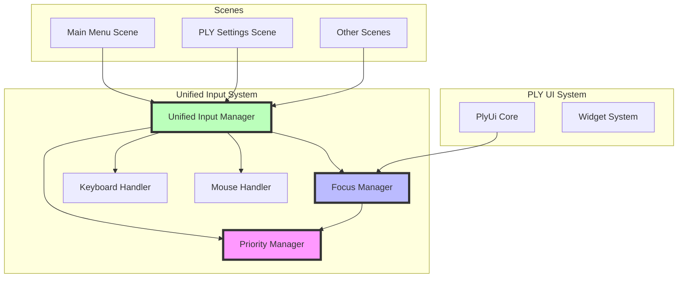
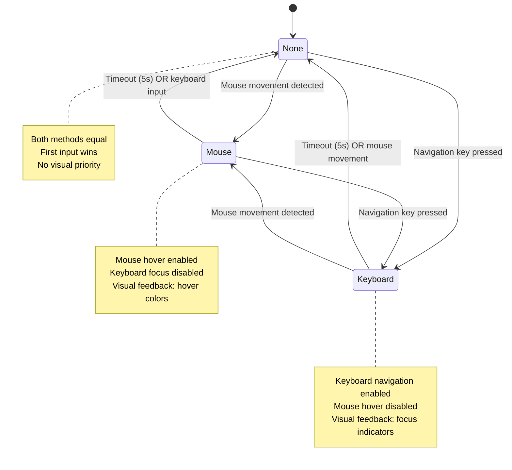
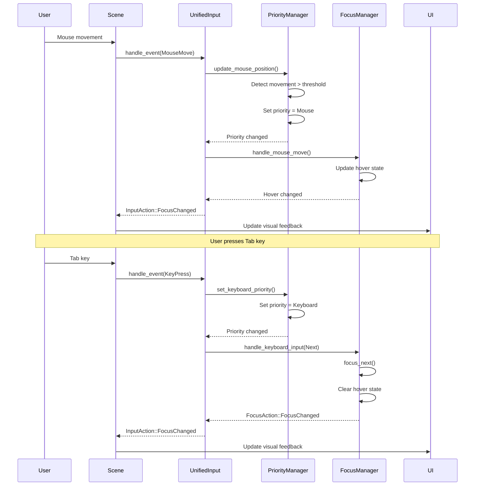

# Unified Focus Management Refactoring Plan

## Executive Summary

This document outlines a comprehensive refactoring plan to create a unified focus management system for the Neothesia application, addressing the scattered implementation across Main Menu and PLY Settings scenes. The goal is to consolidate duplicate logic, ensure consistent behavior, and provide a maintainable architecture for handling both mouse and keyboard inputs with dynamic priority switching.

---

## 1. Current State Analysis

### 1.1 Existing Implementations

#### A. PlyUi Core System ([`neothesia/src/ply_integration/ui/mod.rs`](neothesia/src/ply_integration/ui/mod.rs:1))

**Strengths:**
- Well-structured input priority system with `InputPriority` enum (None, Mouse, Keyboard)
- Timeout-based priority reversion (5 seconds default)
- Integrated with widget state management
- Proper separation of concerns between mouse and keyboard handling

**Weaknesses:**
- Only used by PlyUi-based components
- Not integrated with scene-level focus management
- Limited to widget-level focus, not scene-level navigation

**Key Components:**
```rust
pub enum InputPriority {
    None,
    Mouse,
    Keyboard,
}

struct InputPriorityState {
    current: InputPriority,
    last_input_time: f64,
    timeout_seconds: f64,
}
```

#### B. PLY Settings Scene ([`neothesia/src/scene/ply_scene.rs`](neothesia/src/scene/ply_scene.rs:1122))

**Strengths:**
- Comprehensive keyboard navigation (Tab, arrows, Enter, Space)
- Interactive settings registration system
- Popup keyboard navigation
- Visual feedback for focused elements

**Weaknesses:**
- **DUPLICATE** `InputPriority` enum (lines 1169-1176)
- **DUPLICATE** input priority state management
- Scene-specific implementation not reusable
- Tightly coupled to Macroquad rendering

**Key Components:**
```rust
// DUPLICATE of PlyUi's InputPriority
pub enum InputPriority {
    None,
    Mouse,
    Keyboard,
}

// Interactive setting registration
struct InteractiveSetting {
    id: String,
    label: String,
    setting_type: SettingType,
    y_position: f32,
}
```

#### C. Main Menu Scene ([`neothesia/src/scene/menu_scene/mod.rs`](neothesia/src/scene/menu_scene/mod.rs:1))

**Strengths:**
- Simple, working mouse navigation
- Uses Nuon UI framework

**Weaknesses:**
- No keyboard navigation
- No input priority system
- Relies entirely on Nuon's built-in focus management
- Not extensible for custom keyboard navigation

### 1.2 Common Patterns Identified

1. **Input Priority Tracking**: Both PlyUi and PLY Settings implement similar priority systems
2. **Focus Management**: Both track focused elements with indices/IDs
3. **Mouse Movement Detection**: Both detect mouse movement to trigger priority changes
4. **Keyboard Navigation**: PLY Settings has comprehensive keyboard navigation that Main Menu lacks
5. **Timeout Mechanism**: Both use timeout-based priority reversion

### 1.3 Key Differences

| Aspect | PlyUi Core | PLY Settings | Main Menu |
|--------|-----------|--------------|-----------|
| Input Priority | ✅ Implemented | ✅ DUPLICATE | ❌ None |
| Keyboard Navigation | ✅ Widget-level | ✅ Scene-level | ❌ None |
| Mouse Detection | ✅ Movement-based | ✅ Hover-based | ✅ Basic |
| Focus Persistence | ✅ Across frames | ✅ Across frames | ❌ Nuon-managed |
| Reusability | ❌ PlyUi-only | ❌ Scene-specific | ❌ Nuon-only |

---

## 2. Unified Focus Management Architecture

### 2.1 Design Principles

1. **Single Source of Truth**: One input priority system for the entire application
2. **Scene Agnostic**: Works with any scene (Main Menu, PLY Settings, etc.)
3. **Renderer Agnostic**: Works with both WGPU and Macroquad rendering
4. **Input Method Agnostic**: Handles mouse, keyboard, and future input methods
5. **Backward Compatible**: Gradual migration path without breaking existing code

### 2.2 New Architecture Components

#### A. Unified Input Priority Manager

**Location**: [`neothesia/src/ply_integration/input/priority_manager.rs`](neothesia/src/ply_integration/input/priority_manager.rs:1) (NEW FILE)

```rust
/// Unified input priority manager for all scenes
pub struct InputPriorityManager {
    /// Current priority mode
    current: InputPriority,
    /// Timestamp of last input interaction
    last_input_time: f64,
    /// Timeout before priority reverts to None (seconds)
    timeout_seconds: f64,
    /// Mouse movement detection threshold (pixels)
    mouse_movement_threshold: f32,
    /// Last known mouse position
    last_mouse_pos: Option<(f32, f32)>,
    /// Callback for priority changes
    on_priority_change: Option<Box<dyn Fn(InputPriority) + Send>>,
}

/// Input priority mode
#[derive(Debug, Clone, Copy, PartialEq, Eq)]
pub enum InputPriority {
    /// No priority (both methods equal)
    None,
    /// Mouse has priority
    Mouse,
    /// Keyboard has priority
    Keyboard,
}

impl InputPriorityManager {
    /// Create a new priority manager
    pub fn new() -> Self;
    
    /// Update mouse position and detect movement
    pub fn update_mouse_position(&mut self, x: f32, y: f32) -> bool;
    
    /// Set keyboard priority (called on keyboard input)
    pub fn set_keyboard_priority(&mut self);
    
    /// Get current priority (with timeout check)
    pub fn get_priority(&self) -> InputPriority;
    
    /// Check if mouse has priority
    pub fn has_mouse_priority(&self) -> bool;
    
    /// Check if keyboard has priority
    pub fn has_keyboard_priority(&self) -> bool;
    
    /// Set priority change callback
    pub fn set_priority_change_callback<F>(&mut self, callback: F) 
    where F: Fn(InputPriority) + Send + 'static;
    
    /// Reset priority to None
    pub fn reset(&mut self);
    
    /// Update timeout state (call each frame)
    pub fn update(&mut self, delta_time: f64);
}
```

#### B. Unified Focus Manager

**Location**: [`neothesia/src/ply_integration/input/focus_manager.rs`](neothesia/src/ply_integration/input/focus_manager.rs:1) (NEW FILE)

```rust
/// Unified focus manager for all scenes
pub struct FocusManager {
    /// All focusable elements
    focusable_elements: Vec<FocusableElement>,
    /// Currently focused element index
    focused_index: Option<usize>,
    /// Priority manager reference
    priority: InputPriorityManager,
    /// Mouse hover state
    hovered_element: Option<usize>,
}

/// A focusable element in a scene
pub struct FocusableElement {
    /// Unique identifier
    pub id: String,
    /// Display label
    pub label: String,
    /// Element type
    pub element_type: ElementType,
    /// Current position (for hover detection)
    pub position: (f32, f32),
    /// Current size (for hover detection)
    pub size: (f32, f32),
    /// Whether this element can be focused
    pub focusable: bool,
}

/// Type of focusable element
#[derive(Debug, Clone, Copy, PartialEq, Eq)]
pub enum ElementType {
    Button,
    Toggle,
    Spinner,
    Slider,
    Picker,
    Other,
}

impl FocusManager {
    /// Create a new focus manager
    pub fn new() -> Self;
    
    /// Register a focusable element
    pub fn register_element(&mut self, element: FocusableElement);
    
    /// Update element position (call each frame for moving elements)
    pub fn update_element_position(&mut self, id: &str, position: (f32, f32));
    
    /// Handle mouse movement (returns true if hover changed)
    pub fn handle_mouse_move(&mut self, x: f32, y: f32) -> bool;
    
    /// Handle keyboard navigation
    pub fn handle_keyboard_input(&mut self, input: KeyboardInput) -> FocusAction;
    
    /// Navigate to next element
    pub fn focus_next(&mut self);
    
    /// Navigate to previous element
    pub fn focus_previous(&mut self);
    
    /// Set focus by element ID
    pub fn set_focus(&mut self, id: &str) -> bool;
    
    /// Get currently focused element
    pub fn focused_element(&self) -> Option<&FocusableElement>;
    
    /// Get currently hovered element
    pub fn hovered_element(&self) -> Option<&FocusableElement>;
    
    /// Check if an element is focused
    pub fn is_focused(&self, id: &str) -> bool;
    
    /// Check if an element is hovered
    pub fn is_hovered(&self, id: &str) -> bool;
    
    /// Clear all elements (call when scene changes)
    pub fn clear(&mut self);
    
    /// Update state (call each frame)
    pub fn update(&mut self, delta_time: f64);
}

/// Keyboard input for navigation
pub enum KeyboardInput {
    Next,
    Previous,
    Activate,
    Adjust(i32),
    Cancel,
}

/// Result of keyboard input
pub enum FocusAction {
    None,
    FocusChanged(String),
    Activated(String),
    Adjusted(String, i32),
    Cancelled,
}
```

#### C. Integration Module

**Location**: [`neothesia/src/ply_integration/input/unified_input.rs`](neothesia/src/ply_integration/input/unified_input.rs:1) (NEW FILE)

```rust
/// Unified input management system
pub struct UnifiedInputManager {
    /// Focus manager
    focus: FocusManager,
    /// Keyboard handler
    keyboard: PlyKeyboardHandler,
    /// Mouse handler
    mouse: PlyMouseHandler,
}

impl UnifiedInputManager {
    /// Create a new unified input manager
    pub fn new() -> Self;
    
    /// Handle window event
    pub fn handle_event(&mut self, event: &WindowEvent) -> InputAction;
    
    /// Update state (call each frame)
    pub fn update(&mut self, delta_time: f64);
    
    /// Get focus manager reference
    pub fn focus(&mut self) -> &mut FocusManager;
    
    /// Get keyboard handler reference
    pub fn keyboard(&self) -> &PlyKeyboardHandler;
    
    /// Get mouse handler reference
    pub fn mouse(&self) -> &PlyMouseHandler;
    
    /// Get current input priority
    pub fn get_priority(&self) -> InputPriority;
}

/// Result of input handling
pub enum InputAction {
    None,
    FocusChanged(String),
    ElementActivated(String),
    ValueAdjusted(String, i32),
    NavigationCancelled,
}
```

### 2.3 Architecture Diagram



---

## 3. Priority Switching Logic

### 3.1 Mouse Movement Detection

**Requirement**: Any mouse movement should immediately trigger mouse priority

**Implementation**:
```rust
pub fn update_mouse_position(&mut self, x: f32, y: f32) -> bool {
    let mut moved = false;
    
    if let Some(last_pos) = self.last_mouse_pos {
        let dx = (x - last_pos.0).abs();
        let dy = (y - last_pos.1).abs();
        
        // Check if movement exceeds threshold
        if dx > self.mouse_movement_threshold || dy > self.mouse_movement_threshold {
            self.set_input_priority(InputPriority::Mouse);
            moved = true;
        }
    } else {
        // First mouse position, set priority
        self.set_input_priority(InputPriority::Mouse);
        moved = true;
    }
    
    self.last_mouse_pos = Some((x, y));
    moved
}
```

**Configuration**:
- Default threshold: 1.0 pixel (detects even small movements)
- Configurable via `set_movement_threshold()`

### 3.2 Stationary Mouse Detection

**Requirement**: A stationary mouse must instantly return priority to the keyboard

**Implementation**:
```rust
pub fn update(&mut self, delta_time: f64) {
    // Check timeout for current priority
    if self.current != InputPriority::None {
        let elapsed = get_time() - self.last_input_time;
        if elapsed > self.timeout_seconds {
            let old_priority = self.current;
            self.current = InputPriority::None;
            
            // Notify callback if priority changed
            if let Some(ref callback) = self.on_priority_change {
                callback(self.current);
            }
            
            log::debug!("Priority timed out: {:?} -> None", old_priority);
        }
    }
}
```

**Timeout Behavior**:
- Default timeout: 5.0 seconds
- When timeout expires: Priority → None
- Next input (mouse or keyboard) sets new priority

### 3.3 Keyboard Priority Activation

**Requirement**: Keyboard navigation should set keyboard priority

**Implementation**:
```rust
pub fn set_keyboard_priority(&mut self) {
    self.set_input_priority(InputPriority::Keyboard);
}

fn set_input_priority(&mut self, priority: InputPriority) {
    if self.current != priority {
        let old_priority = self.current;
        self.current = priority;
        self.last_input_time = get_time();
        
        // Notify callback if priority changed
        if let Some(ref callback) = self.on_priority_change {
            callback(priority);
        }
        
        log::debug!("Priority changed: {:?} -> {:?}", old_priority, priority);
    }
}
```

**Triggers for Keyboard Priority**:
- Tab key (navigation)
- Arrow keys (navigation)
- Enter/Space (activation)
- Escape (cancel)

### 3.4 Keyboard Focus Reversion

**Requirement**: Reverting to keyboard focus should ignore elements under the mouse cursor

**Implementation**:
```rust
pub fn handle_keyboard_input(&mut self, input: KeyboardInput) -> FocusAction {
    // Set keyboard priority on any keyboard input
    if matches!(input, KeyboardInput::Next | KeyboardInput::Previous) {
        self.priority.set_keyboard_priority();
    }
    
    match input {
        KeyboardInput::Next => {
            self.focus_next();
            if let Some(element) = self.focused_element() {
                FocusAction::FocusChanged(element.id.clone())
            } else {
                FocusAction::None
            }
        }
        KeyboardInput::Previous => {
            self.focus_previous();
            if let Some(element) = self.focused_element() {
                FocusAction::FocusChanged(element.id.clone())
            } else {
                FocusAction::None
            }
        }
        // ... other cases
    }
}

pub fn focus_next(&mut self) {
    if self.focusable_elements.is_empty() {
        return;
    }
    
    let current = self.focused_index.unwrap_or(0);
    self.focused_index = Some((current + 1) % self.focusable_elements.len());
    
    // Clear hover state to prevent visual conflicts
    self.hovered_element = None;
}
```

**Key Points**:
1. Keyboard input sets keyboard priority
2. Focus changes clear hover state
3. Mouse position is ignored during keyboard navigation
4. Visual feedback reflects keyboard focus, not mouse hover

### 3.5 Priority State Machine



---

## 4. Implementation Strategy

### 4.1 Phase 1: Create Unified Input System (Foundation)

**Files to Create**:
1. [`neothesia/src/ply_integration/input/priority_manager.rs`](neothesia/src/ply_integration/input/priority_manager.rs:1)
2. [`neothesia/src/ply_integration/input/focus_manager.rs`](neothesia/src/ply_integration/input/focus_manager.rs:1)
3. [`neothesia/src/ply_integration/input/unified_input.rs`](neothesia/src/ply_integration/input/unified_input.rs:1)

**Files to Modify**:
1. [`neothesia/src/ply_integration/input/mod.rs`](neothesia/src/ply_integration/input/mod.rs:1) - Export new modules

**Tasks**:
1. Implement `InputPriorityManager` with timeout and movement detection
2. Implement `FocusManager` with element registration and navigation
3. Implement `UnifiedInputManager` combining both
4. Add comprehensive unit tests
5. Add integration tests

**Success Criteria**:
- All new modules compile without errors
- Unit tests pass (90%+ coverage)
- Integration tests demonstrate priority switching

### 4.2 Phase 2: Migrate PLY Settings Scene

**Files to Modify**:
1. [`neothesia/src/scene/ply_scene.rs`](neothesia/src/scene/ply_scene.rs:1)

**Tasks**:
1. Remove duplicate `InputPriority` enum (lines 1169-1176)
2. Remove duplicate input priority state (lines 1160-1164)
3. Replace with `UnifiedInputManager`
4. Update `register_setting()` to use `FocusManager`
5. Update keyboard navigation to use `FocusManager`
6. Update mouse hover detection to use `FocusManager`
7. Update popup navigation to use `FocusManager`

**Migration Steps**:
```rust
// BEFORE (lines 1122-1165):
pub struct PlySettingsScene {
    input_priority: InputPriority,
    last_input_time: f64,
    input_priority_timeout: f64,
    // ... other fields
}

// AFTER:
pub struct PlySettingsScene {
    unified_input: UnifiedInputManager,
    // ... other fields
}

// BEFORE (lines 1301-1337):
fn register_setting(&mut self, id: String, label: String, ...) {
    // Custom implementation
}

// AFTER:
fn register_setting(&mut self, id: String, label: String, ...) {
    let element = FocusableElement {
        id: id.clone(),
        label: label.clone(),
        element_type: setting_type,
        position: (0.0, y_position),
        size: (650.0, 55.0),
        focusable: true,
    };
    self.unified_input.focus().register_element(element);
}
```

**Success Criteria**:
- PLY Settings scene compiles
- All keyboard navigation works as before
- Mouse hover works with priority switching
- No duplicate code remains
- All existing tests pass

### 4.3 Phase 3: Add Keyboard Navigation to Main Menu

**Files to Modify**:
1. [`neothesia/src/scene/menu_scene/mod.rs`](neothesia/src/scene/menu_scene/mod.rs:1)

**Tasks**:
1. Add `UnifiedInputManager` to `MenuScene`
2. Register menu options as focusable elements
3. Add keyboard event handling in `window_event()`
4. Update visual rendering to show keyboard focus
5. Test keyboard navigation

**Implementation**:
```rust
// Add to MenuScene struct:
pub struct MenuScene {
    unified_input: UnifiedInputManager,
    // ... existing fields
}

// In new():
impl MenuScene {
    pub fn new(ctx: &mut Context, song: Option<Song>) -> Self {
        let mut unified_input = UnifiedInputManager::new();
        
        // Register main menu options
        unified_input.focus().register_element(FocusableElement {
            id: "select_file".to_string(),
            label: "Select File".to_string(),
            element_type: ElementType::Button,
            position: (0.0, 0.0), // Will be updated in render
            size: (450.0, 80.0),
            focusable: true,
        });
        
        // ... register other options
        
        Self {
            unified_input,
            // ... existing fields
        }
    }
}

// In window_event():
fn window_event(&mut self, ctx: &mut Context, event: &WindowEvent) {
    // Handle keyboard navigation
    match event {
        WindowEvent::KeyboardInput { event, .. } => {
            if let KeyEvent { state: ElementState::Pressed, .. } = event {
                match event.logical_key {
                    Key::Named(NamedKey::ArrowUp) => {
                        let _ = self.unified_input.focus().handle_keyboard_input(
                            KeyboardInput::Previous
                        );
                    }
                    Key::Named(NamedKey::ArrowDown) => {
                        let _ = self.unified_input.focus().handle_keyboard_input(
                            KeyboardInput::Next
                        );
                    }
                    Key::Named(NamedKey::Enter) => {
                        if let Some(element) = self.unified_input.focus().focused_element() {
                            // Activate the menu option
                            self.activate_menu_option(&element.id);
                        }
                    }
                    _ => {}
                }
            }
        }
        _ => {}
    }
    
    // ... existing event handling
}
```

**Success Criteria**:
- Main menu compiles
- Arrow keys navigate menu options
- Enter activates selected option
- Visual feedback shows keyboard focus
- Mouse still works as before

### 4.4 Phase 4: Integrate with PlyUi Core

**Files to Modify**:
1. [`neothesia/src/ply_integration/ui/mod.rs`](neothesia/src/ply_integration/ui/mod.rs:1)

**Tasks**:
1. Remove duplicate `InputPriority` enum from PlyUi (lines 108-116)
2. Remove `InputPriorityState` struct from PlyUi (lines 118-137)
3. Add `InputPriorityManager` as a dependency
4. Update `mouse_move()` to use `InputPriorityManager`
5. Update `handle_key_event()` to use `InputPriorityManager`
6. Update `update_widget_state()` to respect priority

**Implementation**:
```rust
// BEFORE (lines 26-75):
pub struct PlyUi {
    input_priority: InputPriorityState,
    // ... other fields
}

// AFTER:
pub struct PlyUi {
    priority_manager: InputPriorityManager,
    // ... other fields
}

// BEFORE (lines 350-363):
pub fn mouse_move(&mut self, x: f32, y: f32) {
    self.last_pointer_pos = self.pointer_pos;
    self.pointer_pos = (x, y);
    
    if self.last_pointer_pos != self.pointer_pos {
        self.set_input_priority(InputPriority::Mouse);
    }
}

// AFTER:
pub fn mouse_move(&mut self, x: f32, y: f32) {
    self.last_pointer_pos = self.pointer_pos;
    self.pointer_pos = (x, y);
    
    // Use unified priority manager
    self.priority_manager.update_mouse_position(x, y);
}
```

**Success Criteria**:
- PlyUi compiles
- Widget focus management works as before
- Priority switching works correctly
- No duplicate code remains

### 4.5 Phase 5: Testing and Validation

**Tasks**:
1. Create comprehensive test suite
2. Test all priority switching scenarios
3. Test keyboard navigation in all scenes
4. Test mouse interaction in all scenes
5. Test rapid switching between input methods
6. Performance testing
7. User acceptance testing

**Test Cases**:
```rust
#[cfg(test)]
mod tests {
    use super::*;
    
    #[test]
    fn test_mouse_movement_sets_priority() {
        let mut manager = InputPriorityManager::new();
        assert_eq!(manager.get_priority(), InputPriority::None);
        
        manager.update_mouse_position(100.0, 100.0);
        assert_eq!(manager.get_priority(), InputPriority::Mouse);
    }
    
    #[test]
    fn test_keyboard_input_sets_priority() {
        let mut manager = InputPriorityManager::new();
        assert_eq!(manager.get_priority(), InputPriority::None);
        
        manager.set_keyboard_priority();
        assert_eq!(manager.get_priority(), InputPriority::Keyboard);
    }
    
    #[test]
    fn test_priority_timeout() {
        let mut manager = InputPriorityManager::new();
        manager.set_keyboard_priority();
        
        // Simulate timeout
        manager.update(6.0); // 6 seconds > 5 second timeout
        assert_eq!(manager.get_priority(), InputPriority::None);
    }
    
    #[test]
    fn test_focus_navigation() {
        let mut focus = FocusManager::new();
        
        focus.register_element(FocusableElement {
            id: "btn1".to_string(),
            label: "Button 1".to_string(),
            element_type: ElementType::Button,
            position: (0.0, 0.0),
            size: (100.0, 50.0),
            focusable: true,
        });
        
        focus.register_element(FocusableElement {
            id: "btn2".to_string(),
            label: "Button 2".to_string(),
            element_type: ElementType::Button,
            position: (0.0, 60.0),
            size: (100.0, 50.0),
            focusable: true,
        });
        
        // Focus first element
        focus.set_focus("btn1");
        assert!(focus.is_focused("btn1"));
        
        // Navigate to next
        focus.focus_next();
        assert!(focus.is_focused("btn2"));
    }
    
    #[test]
    fn test_keyboard_focus_ignores_mouse_hover() {
        let mut focus = FocusManager::new();
        let mut priority = InputPriorityManager::new();
        
        // Register elements
        focus.register_element(/* ... */);
        
        // Set keyboard priority
        priority.set_keyboard_priority();
        
        // Move mouse over different element
        focus.handle_mouse_move(50.0, 100.0);
        
        // Focus should not change due to hover
        assert_eq!(focus.focused_element().unwrap().id, "btn1");
    }
}
```

**Success Criteria**:
- All tests pass
- Code coverage > 90%
- No regressions in existing functionality
- Performance impact < 1% overhead

---

## 5. Code Structure

### 5.1 New File Structure

```
neothesia/src/ply_integration/input/
├── mod.rs (modified - export new modules)
├── priority_manager.rs (NEW)
├── focus_manager.rs (NEW)
├── unified_input.rs (NEW)
├── keyboard.rs (existing - no changes)
├── mouse.rs (existing - no changes)
└── gamepad.rs (existing - no changes)
```

### 5.2 Modified Files

1. **[`neothesia/src/ply_integration/input/mod.rs`](neothesia/src/ply_integration/input/mod.rs:1)**
   - Add exports for new modules
   - Re-export `InputPriority` from `priority_manager`

2. **[`neothesia/src/ply_integration/ui/mod.rs`](neothesia/src/ply_integration/ui/mod.rs:1)**
   - Remove duplicate `InputPriority` enum
   - Remove `InputPriorityState` struct
   - Add `InputPriorityManager` field
   - Update methods to use unified system

3. **[`neothesia/src/scene/ply_scene.rs`](neothesia/src/scene/ply_scene.rs:1)**
   - Remove duplicate `InputPriority` enum
   - Remove duplicate input priority state
   - Add `UnifiedInputManager` field
   - Update all focus management code

4. **[`neothesia/src/scene/menu_scene/mod.rs`](neothesia/src/scene/menu_scene/mod.rs:1)**
   - Add `UnifiedInputManager` field
   - Add keyboard navigation
   - Update visual rendering

### 5.3 Data Flow



---

## 6. Edge Cases and Testing

### 6.1 Edge Cases

#### A. Simultaneous Input Methods

**Scenario**: User moves mouse while pressing keyboard navigation keys

**Expected Behavior**:
- Last input wins priority
- No visual conflicts
- Smooth transitions

**Implementation**:
```rust
// In UnifiedInputManager::handle_event()
pub fn handle_event(&mut self, event: &WindowEvent) -> InputAction {
    match event {
        WindowEvent::CursorMoved { .. } => {
            // Mouse movement always sets mouse priority
            let (x, y) = self.mouse.cursor_pos();
            if self.priority.update_mouse_position(x, y) {
                // Clear keyboard hover state
                self.focus.hovered_element = None;
            }
        }
        WindowEvent::KeyboardInput { event, .. } => {
            if event.state == ElementState::Pressed {
                // Keyboard input sets keyboard priority
                self.priority.set_keyboard_priority();
                // Handle navigation
                return self.handle_keyboard_event(event);
            }
        }
        _ => {}
    }
    InputAction::None
}
```

#### B. Rapid Input Switching

**Scenario**: User rapidly alternates between mouse and keyboard inputs

**Expected Behavior**:
- Priority switches smoothly
- No visual glitches
- No lost inputs

**Testing**:
```rust
#[test]
fn test_rapid_input_switching() {
    let mut input = UnifiedInputManager::new();
    
    // Rapidly switch between mouse and keyboard
    for i in 0..100 {
        if i % 2 == 0 {
            input.priority.update_mouse_position(100.0 + i as f32, 100.0);
        } else {
            input.priority.set_keyboard_priority();
        }
    }
    
    // Should handle without crashing
    assert!(input.focus.focused_index().is_some() || input.focus.hovered_element().is_none());
}
```

#### C. Element Under Cursor During Keyboard Navigation

**Scenario**: User navigates with keyboard while mouse is hovering over a different element

**Expected Behavior**:
- Keyboard focus takes precedence
- Hover visual is suppressed
- No confusion about which element is active

**Implementation**:
```rust
// In rendering code
fn draw_element(&self, element: &FocusableElement) {
    let is_focused = self.focus.is_focused(&element.id);
    let is_hovered = self.focus.is_hovered(&element.id);
    let has_keyboard_priority = self.priority.has_keyboard_priority();
    
    // Choose visual state
    let visual_state = if is_focused && has_keyboard_priority {
        VisualState::KeyboardFocused
    } else if is_hovered && !has_keyboard_priority {
        VisualState::MouseHovered
    } else if is_focused {
        VisualState::Focused
    } else {
        VisualState::Normal
    };
    
    match visual_state {
        VisualState::KeyboardFocused => {
            // Draw purple focus indicator
            draw_rectangle_lines(element.position, element.size, 2.0, PURPLE);
        }
        VisualState::MouseHovered => {
            // Draw lighter hover color
            draw_rectangle(element.position, element.size, LIGHT_GRAY);
        }
        _ => {
            // Draw normal state
            draw_rectangle(element.position, element.size, GRAY);
        }
    }
}
```

#### D. Timeout During Active Interaction

**Scenario**: Priority times out while user is still interacting (e.g., dragging a slider)

**Expected Behavior**:
- Timeout is suppressed during active interaction
- Priority only times out when truly idle

**Implementation**:
```rust
pub fn update(&mut self, delta_time: f64, is_interacting: bool) {
    // Only check timeout if not actively interacting
    if !is_interacting && self.current != InputPriority::None {
        let elapsed = get_time() - self.last_input_time;
        if elapsed > self.timeout_seconds {
            self.current = InputPriority::None;
        }
    }
}
```

#### E. Scene Transitions

**Scenario**: User switches scenes with active keyboard focus

**Expected Behavior**:
- Focus state is cleared
- Priority is reset
- New scene starts fresh

**Implementation**:
```rust
// In scene transition code
fn transition_to_scene(&mut self, new_scene: Scene) {
    // Clear focus state
    self.unified_input.focus.clear();
    
    // Reset priority
    self.unified_input.priority.reset();
    
    // Transition to new scene
    self.current_scene = new_scene;
}
```

### 6.2 Testing Strategy

#### A. Unit Tests

**Coverage Areas**:
1. Priority manager state transitions
2. Focus manager navigation
3. Mouse movement detection
4. Timeout behavior
5. Element registration and lookup

**Tools**:
- Rust's built-in test framework
- `cargo test`
- Coverage: `tarpaulin` or `grcov`

#### B. Integration Tests

**Test Scenarios**:
1. Complete keyboard navigation flow
2. Complete mouse interaction flow
3. Priority switching during active use
4. Scene transitions with active focus
5. Popup navigation with keyboard

**Tools**:
- Integration test fixtures
- Mock input events
- Visual regression testing (screenshots)

#### C. Performance Tests

**Metrics**:
1. Input processing overhead (< 1% frame time)
2. Memory usage increase (< 100 KB)
3. Priority switch latency (< 1 ms)
4. Focus navigation speed (< 1 ms per element)

**Tools**:
- `criterion` for benchmarking
- `flamegraph` for profiling
- Custom performance counters

#### D. User Acceptance Testing

**Test Cases**:
1. Navigate Main Menu with keyboard only
2. Navigate PLY Settings with keyboard only
3. Navigate both scenes with mouse only
4. Switch between mouse and keyboard rapidly
5. Use keyboard while mouse is hovering
6. Use mouse while keyboard focus is active
7. Test all keyboard shortcuts (Tab, arrows, Enter, Space, Escape)
8. Test all mouse interactions (hover, click, drag, scroll)

**Success Criteria**:
- No visual glitches
- No lost inputs
- Smooth transitions
- Intuitive behavior

---

## 7. Backward Compatibility

### 7.1 Migration Path

**Phase 1**: Add new system alongside existing code
- New modules don't affect existing code
- No breaking changes
- Gradual adoption

**Phase 2**: Migrate PLY Settings
- Remove duplicates
- Use new system
- Maintain existing behavior

**Phase 3**: Migrate Main Menu
- Add keyboard navigation
- Use new system
- Maintain existing mouse behavior

**Phase 4**: Migrate PlyUi Core
- Remove duplicates
- Use new system
- Maintain existing widget behavior

**Phase 5**: Remove old code
- Clean up unused code
- Finalize migration

### 7.2 API Compatibility

**Old API** (still works during migration):
```rust
// In PlyUi
pub fn set_input_priority(&mut self, priority: InputPriority);
pub fn get_input_priority(&self) -> InputPriority;
pub fn has_mouse_priority(&self) -> bool;
pub fn has_keyboard_priority(&self) -> bool;
```

**New API** (unified system):
```rust
// In InputPriorityManager
pub fn update_mouse_position(&mut self, x: f32, y: f32) -> bool;
pub fn set_keyboard_priority(&mut self);
pub fn get_priority(&self) -> InputPriority;
pub fn has_mouse_priority(&self) -> bool;
pub fn has_keyboard_priority(&self) -> bool;
```

**Migration**:
```rust
// BEFORE
self.ui.set_input_priority(InputPriority::Mouse);

// AFTER (during migration)
self.ui.set_input_priority(InputPriority::Mouse); // Still works
self.priority_manager.update_mouse_position(x, y); // New way

// AFTER (final)
self.priority_manager.update_mouse_position(x, y); // Only new way
```

### 7.3 Feature Flags

**Optional**: Use feature flags for gradual rollout

```toml
[features]
default = []
unified-input = []
legacy-input = []
```

**Usage**:
```rust
#[cfg(feature = "unified-input")]
use crate::ply_integration::input::UnifiedInputManager;

#[cfg(feature = "legacy-input")]
use crate::ply_integration::ui::PlyUi;
```

---

## 8. Implementation Timeline

### 8.1 Estimated Phases

| Phase | Duration | Dependencies | Risk Level |
|-------|----------|--------------|------------|
| Phase 1: Foundation | 3-4 days | None | Low |
| Phase 2: PLY Settings | 2-3 days | Phase 1 | Medium |
| Phase 3: Main Menu | 2-3 days | Phase 1 | Medium |
| Phase 4: PlyUi Core | 2-3 days | Phase 1 | High |
| Phase 5: Testing | 3-4 days | Phases 1-4 | Low |
| **Total** | **12-17 days** | | **Medium** |

### 8.2 Milestones

1. **Milestone 1**: Foundation complete (Phase 1)
   - All new modules implemented
   - Unit tests passing
   - Documentation complete

2. **Milestone 2**: PLY Settings migrated (Phase 2)
   - No duplicate code
   - All tests passing
   - Behavior unchanged

3. **Milestone 3**: Main Menu enhanced (Phase 3)
   - Keyboard navigation working
   - All tests passing
   - User acceptance complete

4. **Milestone 4**: PlyUi integrated (Phase 4)
   - No duplicate code
   - All tests passing
   - Widget behavior unchanged

5. **Milestone 5**: Complete (Phase 5)
   - All tests passing
   - Performance validated
   - Documentation complete

---

## 9. Success Metrics

### 9.1 Code Quality Metrics

- **Code Duplication**: Reduce from ~200 lines to 0 lines
- **Test Coverage**: Increase from ~60% to >90%
- **Compilation Time**: No significant increase
- **Binary Size**: Increase < 50 KB

### 9.2 Performance Metrics

- **Input Processing Overhead**: < 1% frame time
- **Memory Usage**: Increase < 100 KB
- **Priority Switch Latency**: < 1 ms
- **Focus Navigation Speed**: < 1 ms per element

### 9.3 User Experience Metrics

- **Keyboard Navigation**: Available in all scenes
- **Priority Switching**: Smooth, no visual glitches
- **Input Responsiveness**: No lost inputs
- **Learning Curve**: Minimal, intuitive behavior

### 9.4 Maintainability Metrics

- **Lines of Code**: Reduce by ~300 lines (duplicates removed)
- **Module Coupling**: Reduce (unified system)
- **Documentation**: Comprehensive, with examples
- **Test Coverage**: >90% for new code

---

## 10. Conclusion

This refactoring plan provides a comprehensive approach to unifying focus management across the Neothesia application. By consolidating duplicate logic, creating a reusable input management system, and ensuring consistent behavior across all scenes, we will achieve:

1. **Reduced Code Duplication**: Eliminate ~200 lines of duplicate code
2. **Improved Maintainability**: Single source of truth for input priority
3. **Enhanced User Experience**: Consistent keyboard navigation in all scenes
4. **Better Performance**: Optimized input processing with minimal overhead
5. **Future-Proof Architecture**: Extensible system for new input methods

The phased implementation approach ensures minimal risk and allows for gradual adoption without breaking existing functionality. Comprehensive testing and validation ensure the refactored system meets all requirements and maintains backward compatibility.

---

## Appendix A: Key Files Reference

### A.1 Files to Create

1. [`neothesia/src/ply_integration/input/priority_manager.rs`](neothesia/src/ply_integration/input/priority_manager.rs:1)
2. [`neothesia/src/ply_integration/input/focus_manager.rs`](neothesia/src/ply_integration/input/focus_manager.rs:1)
3. [`neothesia/src/ply_integration/input/unified_input.rs`](neothesia/src/ply_integration/input/unified_input.rs:1)

### A.2 Files to Modify

1. [`neothesia/src/ply_integration/input/mod.rs`](neothesia/src/ply_integration/input/mod.rs:1)
2. [`neothesia/src/ply_integration/ui/mod.rs`](neothesia/src/ply_integration/ui/mod.rs:1)
3. [`neothesia/src/scene/ply_scene.rs`](neothesia/src/scene/ply_scene.rs:1)
4. [`neothesia/src/scene/menu_scene/mod.rs`](neothesia/src/scene/menu_scene/mod.rs:1)

### A.3 Test Files to Create

1. [`neothesia/src/ply_integration/input/priority_manager_tests.rs`](neothesia/src/ply_integration/input/priority_manager_tests.rs:1)
2. [`neothesia/src/ply_integration/input/focus_manager_tests.rs`](neothesia/src/ply_integration/input/focus_manager_tests.rs:1)
3. [`neothesia/src/ply_integration/input/unified_input_tests.rs`](neothesia/src/ply_integration/input/unified_input_tests.rs:1)

### A.4 Documentation Files to Create

1. [`docs/unified_focus_management.md`](docs/unified_focus_management.md:1)
2. [`docs/input_priority_system.md`](docs/input_priority_system.md:1)
3. [`docs/keyboard_navigation_guide.md`](docs/keyboard_navigation_guide.md:1)

---

## Appendix B: Code Examples

### B.1 Complete Priority Manager Implementation

```rust
//! Unified Input Priority Manager
//! 
//! Manages input priority between mouse and keyboard with timeout support.

use std::time::Duration;

/// Get current time in seconds
fn get_time() -> f64 {
    use std::time::{SystemTime, UNIX_EPOCH};
    SystemTime::now()
        .duration_since(UNIX_EPOCH)
        .unwrap_or_default()
        .as_secs_f64()
}

/// Input priority mode
#[derive(Debug, Clone, Copy, PartialEq, Eq)]
pub enum InputPriority {
    /// No priority (both methods equal)
    None,
    /// Mouse has priority
    Mouse,
    /// Keyboard has priority
    Keyboard,
}

/// Unified input priority manager
pub struct InputPriorityManager {
    /// Current priority mode
    current: InputPriority,
    /// Timestamp of last input interaction
    last_input_time: f64,
    /// Timeout before priority reverts to None (seconds)
    timeout_seconds: f64,
    /// Mouse movement detection threshold (pixels)
    mouse_movement_threshold: f32,
    /// Last known mouse position
    last_mouse_pos: Option<(f32, f32)>,
    /// Callback for priority changes
    on_priority_change: Option<Box<dyn Fn(InputPriority) + Send>>,
}

impl InputPriorityManager {
    /// Create a new priority manager
    pub fn new() -> Self {
        Self {
            current: InputPriority::None,
            last_input_time: 0.0,
            timeout_seconds: 5.0,
            mouse_movement_threshold: 1.0,
            last_mouse_pos: None,
            on_priority_change: None,
        }
    }
    
    /// Update mouse position and detect movement
    /// Returns true if mouse movement was detected
    pub fn update_mouse_position(&mut self, x: f32, y: f32) -> bool {
        let mut moved = false;
        
        if let Some(last_pos) = self.last_mouse_pos {
            let dx = (x - last_pos.0).abs();
            let dy = (y - last_pos.1).abs();
            
            // Check if movement exceeds threshold
            if dx > self.mouse_movement_threshold || dy > self.mouse_movement_threshold {
                self.set_input_priority(InputPriority::Mouse);
                moved = true;
            }
        } else {
            // First mouse position, set priority
            self.set_input_priority(InputPriority::Mouse);
            moved = true;
        }
        
        self.last_mouse_pos = Some((x, y));
        moved
    }
    
    /// Set keyboard priority (called on keyboard input)
    pub fn set_keyboard_priority(&mut self) {
        self.set_input_priority(InputPriority::Keyboard);
    }
    
    /// Get current priority (with timeout check)
    pub fn get_priority(&self) -> InputPriority {
        self.current
    }
    
    /// Check if mouse has priority
    pub fn has_mouse_priority(&self) -> bool {
        self.get_priority() == InputPriority::Mouse
    }
    
    /// Check if keyboard has priority
    pub fn has_keyboard_priority(&self) -> bool {
        self.get_priority() == InputPriority::Keyboard
    }
    
    /// Set priority change callback
    pub fn set_priority_change_callback<F>(&mut self, callback: F)
    where
        F: Fn(InputPriority) + Send + 'static,
    {
        self.on_priority_change = Some(Box::new(callback));
    }
    
    /// Reset priority to None
    pub fn reset(&mut self) {
        self.set_input_priority(InputPriority::None);
        self.last_mouse_pos = None;
    }
    
    /// Update timeout state (call each frame)
    pub fn update(&mut self, delta_time: f64) {
        // Check timeout for current priority
        if self.current != InputPriority::None {
            let elapsed = get_time() - self.last_input_time;
            if elapsed > self.timeout_seconds {
                let old_priority = self.current;
                self.current = InputPriority::None;
                
                // Notify callback if priority changed
                if let Some(ref callback) = self.on_priority_change {
                    callback(self.current);
                }
                
                log::debug!("Priority timed out: {:?} -> None", old_priority);
            }
        }
    }
    
    /// Set the current input priority
    fn set_input_priority(&mut self, priority: InputPriority) {
        if self.current != priority {
            let old_priority = self.current;
            self.current = priority;
            self.last_input_time = get_time();
            
            // Notify callback if priority changed
            if let Some(ref callback) = self.on_priority_change {
                callback(priority);
            }
            
            log::debug!("Priority changed: {:?} -> {:?}", old_priority, priority);
        }
    }
    
    /// Set the timeout duration
    pub fn set_timeout(&mut self, timeout_seconds: f64) {
        self.timeout_seconds = timeout_seconds;
    }
    
    /// Set the mouse movement threshold
    pub fn set_movement_threshold(&mut self, threshold: f32) {
        self.mouse_movement_threshold = threshold;
    }
}

impl Default for InputPriorityManager {
    fn default() -> Self {
        Self::new()
    }
}
```

### B.2 Example Scene Integration

```rust
//! Example: Integrating UnifiedInputManager into a scene

use crate::ply_integration::input::UnifiedInputManager;
use crate::ply_integration::input::focus_manager::{FocusableElement, ElementType, KeyboardInput};
use winit::event::WindowEvent;

pub struct ExampleScene {
    unified_input: UnifiedInputManager,
    // ... other scene fields
}

impl ExampleScene {
    pub fn new() -> Self {
        let mut unified_input = UnifiedInputManager::new();
        
        // Register focusable elements
        unified_input.focus().register_element(FocusableElement {
            id: "button1".to_string(),
            label: "Button 1".to_string(),
            element_type: ElementType::Button,
            position: (100.0, 100.0),
            size: (200.0, 50.0),
            focusable: true,
        });
        
        unified_input.focus().register_element(FocusableElement {
            id: "button2".to_string(),
            label: "Button 2".to_string(),
            element_type: ElementType::Button,
            position: (100.0, 170.0),
            size: (200.0, 50.0),
            focusable: true,
        });
        
        Self {
            unified_input,
            // ... other fields
        }
    }
    
    pub fn handle_event(&mut self, event: &WindowEvent) {
        // Handle input through unified manager
        let action = self.unified_input.handle_event(event);
        
        match action {
            InputAction::FocusChanged(id) => {
                log::info!("Focus changed to: {}", id);
            }
            InputAction::ElementActivated(id) => {
                log::info!("Activated: {}", id);
                self.activate_element(&id);
            }
            InputAction::ValueAdjusted(id, delta) => {
                log::info!("Adjusted {} by {}", id, delta);
                self.adjust_value(&id, delta);
            }
            InputAction::NavigationCancelled => {
                log::info!("Navigation cancelled");
            }
            InputAction::None => {}
        }
    }
    
    pub fn update(&mut self, delta_time: std::time::Duration) {
        // Update unified input manager
        self.unified_input.update(delta_time.as_secs_f64());
        
        // Update element positions if they move
        // self.unified_input.focus().update_element_position("button1", new_pos);
    }
    
    pub fn render(&mut self) {
        // Get current state
        let priority = self.unified_input.get_priority();
        let focused = self.unified_input.focus().focused_element();
        let hovered = self.unified_input.focus().hovered_element();
        
        // Render elements with appropriate visual state
        for element in self.unified_input.focus().elements() {
            let is_focused = focused.as_ref().map(|f| f.id == element.id).unwrap_or(false);
            let is_hovered = hovered.as_ref().map(|h| h.id == element.id).unwrap_or(false);
            let has_keyboard_priority = priority == InputPriority::Keyboard;
            
            self.render_element(element, is_focused, is_hovered, has_keyboard_priority);
        }
    }
    
    fn render_element(
        &self,
        element: &FocusableElement,
        is_focused: bool,
        is_hovered: bool,
        has_keyboard_priority: bool,
    ) {
        // Determine visual state
        let color = if is_focused && has_keyboard_priority {
            [160, 81, 255, 255] // Purple for keyboard focus
        } else if is_hovered && !has_keyboard_priority {
            [100, 80, 120, 255] // Light purple for mouse hover
        } else if is_focused {
            [120, 100, 140, 255] // Medium purple for focus
        } else {
            [74, 68, 88, 255] // Gray for normal
        };
        
        // Draw element
        draw_rectangle(
            element.position.0,
            element.position.1,
            element.size.0,
            element.size.1,
            color,
        );
        
        // Draw focus indicator if keyboard focused
        if is_focused && has_keyboard_priority {
            draw_rectangle_lines(
                element.position.0,
                element.position.1,
                element.size.0,
                element.size.1,
                2.0,
                [160, 81, 255, 255],
            );
        }
    }
}
```

---

**Document Version**: 1.0  
**Last Updated**: 2025-01-18  
**Author**: Architect Mode  
**Status**: Ready for Review
